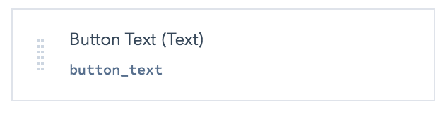

# Back to Top

This module can be used on a page or blog post, to display a minimally styled back to top button that shows in the bottom right hand corner of a page after the user scrolls down 20px from the top of the window.

The module leverages a JavaScript debounce function to reduce the rate at which the scroll function can fire which should optimize the module's performance. More information on the debounce function can be found here: https://davidwalsh.name/javascript-debounce-function

The image below shows the required field for this module:

