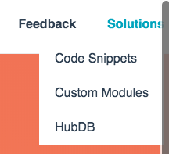

# Last Menu Item Flyout Fix

**Purpose:** to prevent the the last top level menu item's child menu from displaying off of the screen.

## Instructions

Add this snippet to your style-sheet, which will help align the last top level menu item's child menu to the right of the parent menu item vs. the left so that it doesn't appear off of the page when the parent menu item is hovered over on desktop. 

**Before:**

**After:**

