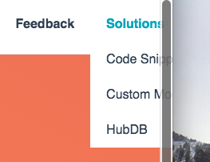

# Last Menu Item Flyout Fix

**Purpose:** to prevent the child menu of the last top level menu item from going off of the page when being hovered over. 

## Instructions 

Add this snippet to your style-sheet, which will help align the child menu to the right of the parent menu item vs. the left so that it doesn't appear off of the page when displaying on desktop.

**Before:**

**After:**

